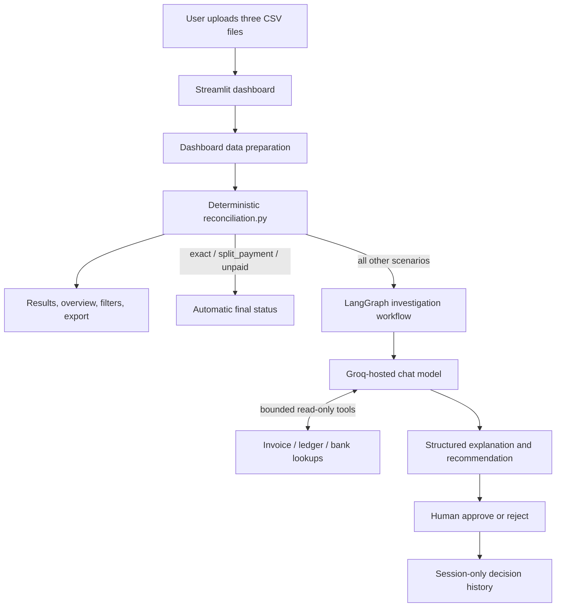
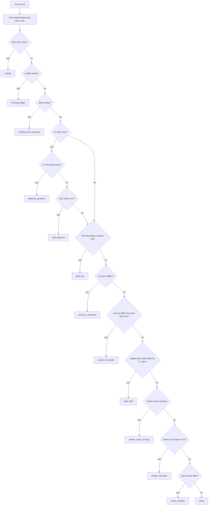

# Architecture

## 1. Purpose and current scope

The Agentic Financial Reconciliation and Audit Copilot compares three financial datasets:

- supplier invoices;
- internal ledger entries; and
- bank transactions.

The implemented application is deliberately **deterministic first**. Python code links records, performs financial comparisons, and assigns one reconciliation scenario and action. AI is used only after that classification to collect bounded supporting evidence and produce a reviewer-facing explanation and recommendation. A human makes the final decision for anomaly cases.

This document describes the repository as it is currently implemented. Some items described as future architecture in `README.md`—notably PostgreSQL persistence, a service layer, a working FastAPI API, and evaluation code—are not implemented in the present source tree. `api/main.py`, `src/main.py`, `evaluation/evaluate.py`, and `evaluation/metrics.py` are placeholders.

## 2. System context



The current runnable entry point is `dashboard/app.py`, served by Streamlit on port `8503` in the Docker image. The application keeps uploaded data, reconciliation output, graph checkpoints, AI output, and review history in process/session memory. There is no persistent database in the current implementation.

## 3. Repository components

| Path | Responsibility | Current status |
|---|---|---|
| `dashboard/app.py` | CSV upload, dashboard-specific preparation, reconciliation execution, case views, AI investigation, human review, session history, export | Implemented |
| `src/ingestion/validators.py` | Schema, primary-key, amount, date, and ground-truth validation | Implemented; used by the standalone loader, not by the dashboard |
| `src/ingestion/loader.py` | Load project CSVs, validate them, and map source columns to the common reconciliation schema | Implemented |
| `src/reconciliation/reconciliation.py` | Pure Python record linking, comparisons, scenario classification, actions, and bank-only detection | Implemented |
| `src/tools/tools.py` | Read-only lookup/search wrappers over the reconciliation data | Implemented |
| `src/agent/agent_tools.py` | LangChain tool definitions with compact fields and five-record limits | Implemented |
| `src/agent/state.py` | Typed shared state for the LangGraph workflow | Implemented |
| `src/agent/nodes.py` | Case loading, routing, AI calls, human interrupt, and finalization | Implemented |
| `src/agent/prompts.py` | Deterministic-rule descriptions, safety constraints, and structured AI output model | Implemented |
| `src/agent/workflow.py` | LangGraph node/edge assembly and in-memory checkpointing | Implemented |
| `tests/` | Unit and workflow tests for ingestion, reconciliation, tools, and routing/review behavior | Implemented |
| `api/main.py`, `src/main.py` | Proposed application/API entry points | Placeholder |
| `evaluation/evaluate.py`, `evaluation/metrics.py` | Proposed ground-truth evaluation | Placeholder |
| database/service modules shown in `README.md` | Proposed persistence and orchestration layers | Not present |

## 4. Data flow and contracts

### 4.1 Source CSVs

The operational inputs are:

- `invoices.csv`;
- `ledger_entries.csv`; and
- `bank_transactions.csv`.

The ground-truth CSV under `data/evaluation/` is separate and is not an input to reconciliation or to the AI workflow.

### 4.2 Common reconciliation schema

`src/ingestion/loader.py` maps source-specific names into common fields:

| Dataset | Source field | Common field |
|---|---|---|
| Invoices | `vendor_name` | `vendor` |
| Invoices | `invoice_date` | `date` |
| Invoices | `total_amount` | `amount` |
| Invoices | `invoice_id` | generated `reference` |
| Ledger | `vendor_name` | `vendor` |
| Ledger | `posting_date` | `date` |
| Bank | `counterparty_name` | `vendor` |
| Bank | `transaction_date` | `date` |

The loader converts dates with `pd.to_datetime`, amounts with `pd.to_numeric(..., errors="coerce")`, uppercases currency, and trims `vendor`, `currency`, and `reference` strings. Before cleaning, `validate_dataframe` checks required columns, null/duplicate primary keys, numeric amounts, and valid dates. Ground truth has a separate validation path.

The dashboard has its own `prepare_data` function. It performs the column renames and checks required columns, but it does not call `src/ingestion/validators.py` or `clean_dataframe`. Consequently, the standalone ingestion path and the current UI path are similar but not identical.

### 4.3 Core input expectations

After preparation, `reconciliation.py` expects at least:

| DataFrame | Required fields used by reconciliation |
|---|---|
| Invoice | `invoice_id`, `vendor`, `amount`, `currency` |
| Ledger | `ledger_entry_id`, `invoice_id`, `reference`, `vendor`, `amount`, `currency`, `date` |
| Bank | `transaction_id`, `reference`, `vendor`, `amount`, `currency`, `date`, `description` |

Each classified result contains:

```text
invoice_id
scenario
action
ledger_entry_ids
bank_transaction_ids
vendor_similarity  # only for vendor-related/exact outcomes
```

For bank-only transactions, `invoice_id` can be `None` when no invoice-shaped token appears in the bank reference.

## 5. Complete Python logic in `reconciliation.py`

`src/reconciliation/reconciliation.py` has eight public functions. None invokes an LLM, LangChain, LangGraph, a network service, or a probabilistic model.

### 5.1 `normalize_text(value)`

This function prepares vendor names for comparison:

1. Returns an empty string for a pandas-missing value.
2. Converts the input to a stripped string.
3. Applies Unicode NFKD decomposition and removes combining marks, so accented text such as `Café` becomes `Cafe`.
4. Converts text to uppercase.
5. Expands `&`, `@`, and `%` to `AND`, `AT`, and `PERCENT`.
6. Replaces characters other than `A-Z`, `0-9`, and whitespace with spaces.
7. Removes these whole-word company suffixes: `INC`, `INCORPORATED`, `LLC`, `LTD`, `LIMITED`, `CORP`, `CORPORATION`, `CO`, `COMPANY`, `PVT`, `PRIVATE`, `PLC`, `LTDA`, and `GMBH`.
8. Collapses repeated whitespace and trims the result.

The output is a normalized comparison key; it is not written back to the financial records.

### 5.2 `vendor_similarity(vendor1, vendor2)`

Both names are passed through `normalize_text`. If either normalized value is empty, the result is `None`. Otherwise, Python's `difflib.SequenceMatcher.ratio()` calculates a character-sequence similarity in the range `0.0` to `1.0`, rounded to two decimal places.

This is fuzzy string matching, but it is still deterministic Python logic—not AI or machine learning. The reconciliation threshold is `0.70`.

### 5.3 `get_related_ledgers(invoice_id, ledger_entries)`

A ledger row is related when either:

```text
ledger.invoice_id == invoice_id
OR
ledger.reference == invoice_id
```

Nulls are replaced with empty strings and values are converted to strings before exact, case-sensitive comparison. All matching rows are returned in their original DataFrame order.

### 5.4 `get_related_bank_transactions(invoice_id, bank_transactions)`

A bank row is related when its reference:

- exactly equals the invoice ID; or
- starts with the invoice ID plus `-`, which supports references such as `INV-2026-000279-P1` and `INV-2026-000279-P2`.

The check is an exact, case-sensitive string operation after nulls are replaced with empty strings. Extra text before an invoice ID is not accepted by this function.

### 5.5 `reconcile_invoice(invoice, ledger_entries, bank_transactions)`

This function classifies one invoice. It extracts the invoice ID, numeric amount, uppercased currency, and vendor; finds all related ledger/bank rows; and records their IDs. It then returns at the **first matching rule**, so rule order is part of the business behavior.

#### Rule precedence

| Priority | Condition | Scenario | Action |
|---:|---|---|---|
| 1 | No related ledger and no related bank row | `unpaid` | `NO_BANK_PAYMENT_EXPECTED` |
| 2 | Bank row(s) exist but no ledger row | `missing_ledger` | `FLAG_MISSING_LEDGER_ENTRY` |
| 3 | Ledger row(s) exist but no bank row | `missing_bank_payment` | `INVESTIGATE_MISSING_BANK_PAYMENT` |
| 4 | At least two related bank rows, and at least two individual bank amounts equal the full invoice amount within `0.01` | `duplicate_payment` | `FLAG_DUPLICATE_PAYMENT` |
| 5 | At least two related bank rows whose summed amounts equal the invoice amount within `0.01` | `split_payment` | `RECONCILE_SPLIT_PAYMENT` |
| 6 | First related bank description contains the case-insensitive substring `fee` | `bank_fee` | `REVIEW_POSSIBLE_BANK_FEE` |
| 7 | Invoice currency differs from the first ledger currency or first bank currency | `currency_mismatch` | `MANUAL_REVIEW_CURRENCY_MISMATCH` |
| 8 | Invoice amount differs from the first ledger amount or first bank amount by more than `0.01` | `amount_mismatch` | `MANUAL_REVIEW_AMOUNT_MISMATCH` |
| 9 | Absolute calendar-day difference between the first ledger date and first bank date is at least 3 days | `date_shift` | `INVESTIGATE_DATE_DIFFERENCE` |
| 10 | Invoice-to-ledger or invoice-to-bank vendor similarity is unavailable | `vendor_name_missing` | `MANUAL_REVIEW_VENDOR_NAME_MISSING` |
| 11 | Either vendor similarity is below `0.70` | `vendor_mismatch` | `MANUAL_REVIEW_VENDOR_MISMATCH` |
| 12 | Raw trimmed/uppercased vendor names are not all equal, after both similarities passed `0.70` | `name_variation` | `AUTO_RECONCILE_OR_LOW_RISK_REVIEW` |
| 13 | No preceding rule matched | `exact` | `AUTO_RECONCILE` |

Important implementation details:

- Amount tolerance is inclusive for duplicate/split detection (`<= 0.01`) and exclusive for mismatch detection (`> 0.01`).
- Duplicate detection runs before split detection.
- Bank-fee detection runs before currency and amount checks, so a row whose description contains `fee` is classified as `bank_fee` even if its amount also differs.
- Date shift compares the ledger posting date with the bank transaction date. The invoice date is not involved.
- Vendor comparisons use both the invoice-to-ledger and invoice-to-bank scores; the stored score is their minimum.
- `name_variation` checks the raw names after only trimming and uppercasing. Therefore, `ABC Ltd` and `ABC Limited` can have similarity `1.0` after normalization but still be classified as a name variation.
- After duplicate/split checks, only `related_ledgers.iloc[0]` and `related_bank_transactions.iloc[0]` are used for fee, currency, amount, date, and vendor rules. Other related records do not participate in those later checks.

#### Decision flow



### 5.6 `extract_invoice_id_from_reference(reference)`

This helper returns the first case-sensitive substring matching:

```regex
INV-\d{4}-\d{6}
```

It therefore extracts `INV-2026-000279` from both `Payment for INV-2026-000279` and `INV-2026-000279-P1`. It returns `None` for a missing reference or when the pattern is absent.

### 5.7 `find_bank_only_transactions(invoices, bank_transactions)`

The function builds a set of known invoice IDs and examines every bank row. It extracts an invoice-shaped ID from anywhere in each bank reference using `extract_invoice_id_from_reference`. When the extracted value is not in the known invoice-ID set—including when it is `None`—the function emits:

```text
scenario: bank_only_unmatched
action: CLASSIFY_AS_NON_AP_OR_INVESTIGATE
ledger_entry_ids: []
bank_transaction_ids: [current transaction ID]
```

Unlike invoice-to-bank linking, this detection supports an embedded invoice ID anywhere in the reference. A reference with no invoice token is deliberately treated as bank-only.

### 5.8 `reconcile_all_invoices(invoices, ledger_entries, bank_transactions)`

This batch orchestrator:

1. Iterates over every invoice with `DataFrame.iterrows()`.
2. Calls `reconcile_invoice` once per invoice.
3. Collects all invoice-based results.
4. Calls `find_bank_only_transactions` once.
5. Appends the bank-only results.
6. Returns the complete result list as a pandas DataFrame.

The engine assigns one scenario per invoice. It does not produce multiple anomaly labels for the same invoice because `reconcile_invoice` returns immediately on the first matching rule.

## 6. Deterministic layer versus AI layer

| Concern | Deterministic Python | AI |
|---|---:|---:|
| Link invoice, ledger, and bank records | Yes | No |
| Normalize/compare vendors | Yes | No |
| Compare amount, currency, and dates | Yes | No |
| Detect duplicate/split payments | Yes | No |
| Assign `scenario` and `action` | Yes | No |
| Find bank-only rows | Yes | No |
| Decide whether a case routes to investigation | Yes | No |
| Choose optional read-only evidence tools | No | Yes |
| Summarize supplied evidence | No | Yes |
| Write investigation notes/reviewer guidance | No | Yes |
| Change the deterministic result | No | Explicitly forbidden |
| Approve or reject an anomaly | No | No; human only |

The label “agentic” applies to evidence gathering and workflow control, not to the financial classification itself.

## 7. AI and LangGraph involvement

### 7.1 Model configuration

`src/agent/nodes.py` loads `.env` and constructs `ChatGroq` with:

- `GROQ_API_KEY` from the environment;
- `GROQ_MODEL`, defaulting to `openai/gpt-oss-120b`; and
- temperature `0`.

A second wrapper, `structured_llm`, constrains the final response to the Pydantic `InvestigationOutput` model with two strings: `investigation_notes` and `recommendation`.

### 7.2 Workflow state

`AgentState` can hold identifiers, loaded financial records, the deterministic result, compact evidence, message history, AI notes, recommendation, routing fields, human decision metadata, errors, and final status. LangGraph's `add_messages` reducer appends tool/assistant conversation messages.

### 7.3 Workflow graph

```text
START
  -> load_case
      -> auto_finalize -> END
      -> prepare_investigation -> investigation_agent
             -> tools -> investigation_agent  (zero or more loops)
             -> finalize_investigation
             -> human_review [interrupt]
             -> finalize_review -> END
      -> invoice_not_found -> END
      -> handle_error -> END
```

`create_reconciliation_agent` compiles this graph with `InMemorySaver`. The dashboard supplies a unique `thread_id` and resumes the same checkpoint with `Command(resume=...)` after a reviewer selects approve or reject.

### 7.4 Loading and deterministic routing

`create_load_case_node` supports two entry modes:

- **Invoice case:** load invoice, related ledgers, related banks, and `get_reconciliation_result`; then build compact evidence.
- **Bank-transaction case:** load the bank row, extract an invoice ID, and either redirect to the known invoice case or construct a deterministic `bank_only_unmatched` result.

`route_case` sends only `exact`, `split_payment`, and `unpaid` to automatic finalization. Every other valid scenario—including `name_variation`—goes through AI investigation and human review. Errors and missing invoices take separate non-AI terminal paths.

Automatic statuses are:

| Scenario | Final status |
|---|---|
| `exact` | `AUTO_RECONCILED` |
| `split_payment` | `RECONCILED_SPLIT_PAYMENT` |
| `unpaid` | `UNPAID` |

### 7.5 First AI phase: optional tool selection

`prepare_investigation` seeds a message containing the IDs, deterministic result, and current evidence. The model is bound to four controlled, read-only tools:

- `lookup_invoice(invoice_id)`;
- `lookup_ledger_entries(invoice_id)`;
- `lookup_bank_transactions(invoice_id)`; and
- `search_vendor(vendor_name)`.

The underlying DataFrames are hidden in closures. Tool responses expose only selected fields, and list/search results are capped at five records per source. `ToolNode` executes requested calls, and the model may loop until it returns a message without tool calls.

The tools retrieve evidence; they do not mutate source data, save accounting entries, or recalculate the scenario. `search_vendor` uses the same deterministic vendor-similarity function with a default threshold of `0.70`.

### 7.6 Second AI phase: structured investigation report

`finalize_investigation` takes up to the six most recent agent/tool messages, truncates each included content value to 3,000 characters, combines that history with original evidence, and calls the structured model.

The prompt supplies the already-selected scenario and a textual statement of its deterministic rule. It instructs the model to:

- identify the anomaly;
- cite only supplied/retrieved evidence;
- explain the existing rule rather than invent a new one;
- recommend checks for a reviewer;
- avoid new financial calculations;
- avoid invented transactions, policies, terms, or approvals;
- never override the engine; and
- never make the approve/reject decision.

The desired notes are organized as `Finding`, `Evidence`, and `Why it was flagged`; the recommendation uses `Recommended Action`, `Checks`, and `Decision Guidance`.

If the tool-selection call fails, the workflow records an AI message explaining that no extra evidence was gathered. If final structured generation fails, the state falls back to `Automated investigation failed.` and `Perform manual review.`, preserves an error message, and still requires human review.

### 7.7 Human-in-the-loop boundary

`human_review_case` calls LangGraph `interrupt` with the result, evidence, notes, recommendation, any error, and approve/reject options. On resume it records:

- boolean approval;
- reviewer name;
- UTC review timestamp; and
- human comment.

`finalize_review` maps the decision to `HUMAN_APPROVED` or `HUMAN_REJECTED`. In the present dashboard, this data is stored only in Streamlit session state and disappears with the session/process; it is not written to an audit database.

## 8. Dashboard architecture

The Streamlit application provides six tabs:

1. Upload Data;
2. Overview;
3. Review Cases;
4. Investigation & Review;
5. Decision History; and
6. Export.

After upload, the dashboard prepares the three DataFrames, runs `reconcile_all_invoices`, adds UI fields such as `review_status`, `investigation_notes`, `recommendation`, reviewer metadata, and creates a LangGraph instance over the same in-memory DataFrames.

`exact`, `unpaid`, and `split_payment` results are marked `NOT_REQUIRED` in the review queue. Other results begin as `PENDING`. When a user chooses “Investigate with AI,” the dashboard invokes the graph for either an invoice ID or a bank transaction ID. The graph pauses at human review; approve/reject resumes the checkpoint, updates the result row, and appends an in-session history record.

## 9. Trust, safety, and audit properties

Current safeguards include:

- financial classification remains deterministic and testable;
- the model sees compact evidence rather than unrestricted raw DataFrames;
- AI tools are read-only and return bounded records;
- prompts declare the deterministic result the source of truth;
- anomaly decisions require an explicit human response;
- ground truth is kept outside operational inputs; and
- LLM/tool failures degrade to manual review rather than automatic approval.

Current limitations relevant to production architecture include:

- no persistent database, audit log, authentication, or authorization;
- no working API/service layer;
- checkpoints and decision history are in memory only;
- the dashboard's ingestion validation is less strict than the standalone loader;
- matching is reference-driven and case-sensitive;
- later single-record checks inspect only the first related ledger and bank row;
- `fee` is a plain substring check, so unrelated words containing those letters can match;
- the invoice-ID regex is fixed to `INV-YYYY-NNNNNN` and is case-sensitive;
- `iterrows()` and repeated DataFrame scans favor clarity over large-dataset performance; and
- no model output/evaluation metrics are currently executed by the placeholder evaluation modules.

## 10. Testing and verification boundaries

The test suite covers:

- ingestion validation and cleaning;
- text normalization and vendor similarity;
- ledger/bank relationship lookup;
- every reconciliation scenario and action;
- invoice-ID extraction and bank-only detection;
- batch result composition;
- tool lookup/vendor search behavior; and
- LangGraph automatic routing, investigation/tool behavior, interrupt/resume, and human outcomes using test doubles where appropriate.

The tests establish the intended current behavior, especially rule precedence and the separation between deterministic classification, AI explanation, and human decision-making.
